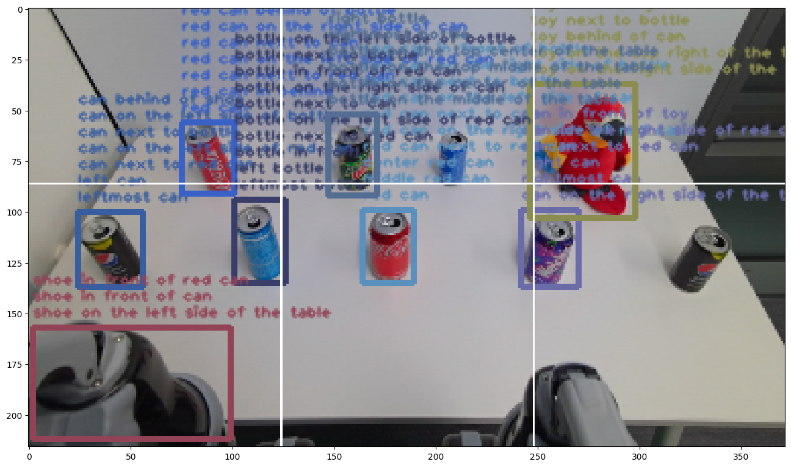
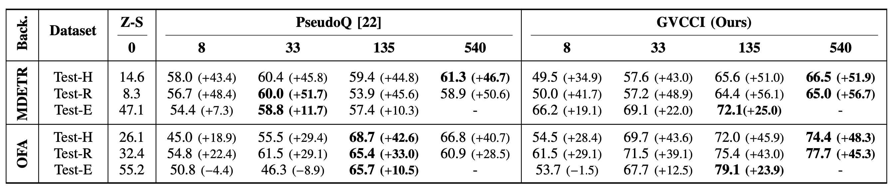
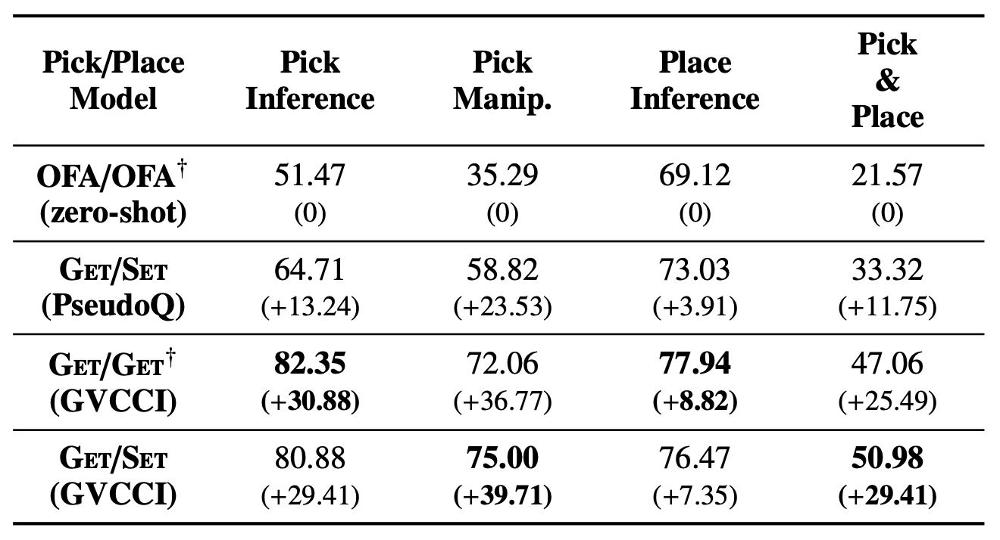

<div align="center">
<figure>
    
</figure>
<h1>GVCCI: Lifelong Learning of Visual Grounding <br> for Language-Guided Robotic Manipulation</h1>
  
**[Junghyun Kim][4], &nbsp; [Gi-Cheon Kang][3]<sup>\*</sup>, &nbsp; [Jaein Kim][5]<sup>\*</sup>, &nbsp; [Suyeon Shin][7], &nbsp; [Byoung-Tak Zhang][6]** <br>

**[The 2023 IEEE/RSJ International Conference on Intelligent Robots and Systems (IROS 2023)][2]**
</div>

<h3 align="center">
<a href="https://arxiv.org/abs/2307.05963">arXiv</a> | <a href="https://drive.google.com/file/d/1QO_ElVKPAxTQo6-pmuHihGgp23WkyBjp/view?usp=sharing">Poster</a> | <a href="https://drive.google.com/file/d/1PeWlImlTqXNKS1N0li2fO9xptHlozCVq/view?usp=sharing">Presentation Video</a> | <a href="https://drive.google.com/file/d/1DfGMTGrifpXlsp_0Y2XbxmNR4VDlRM1u/view?usp=sharing">Demo Video</a>
</h3>

## Overview
<br><br>

Citation
-----------------------------
If you use this code or data in your research, please consider citing:
```bibtex
@article{kim2023gvcci,
  title={Gvcci: Lifelong learning of visual grounding for language-guided robotic manipulation},
  author={Kim, Junghyun and Kang, Gi-Cheon and Kim, Jaein and Shin, Suyeon and Zhang, Byoung-Tak},
  journal={arXiv preprint arXiv:2307.05963},
  year={2023}
}
```

<!--
## Table of Contents
* [Setup and Dependencies](#Setup-and-Dependencies)
* [Download Data](#Download-Data)
* [Pre-trained Checkpoints](#Pre-trained-Checkpoints)
* [Training](#Training)
* [Adaptation to Discriminative Visual Dialog](#Adaptation-to-Discriminative-Visual-Dialog)
* [Visual Dialog Generation](#Visual-Dialog-Generation)
* [Evaluation](#Evaluation)
* [Adversarial Robustness Study](#Adversarial-Robustness-Study)
* [Demo](#Demo)
* [Acknowledgements](#Acknowledgements)
* [License](#License)<br><br>
-->

<br>

Environment Setup
----------------------
Python 3.7+, PyTorch v1.9.1+, CUDA 11+ and CuDNN 7+, Anaconda/Miniconda (recommended) <br>

1. Install Anaconda or Miniconda from [here][8].
2. Clone this repository and create an environment:

```shell
git clone https://www.github.com/JHKim-snu/GVCCI
conda create -n gvcci python=3.8
conda activate gvcci
```

3. Install all dependencies:
```shell
pip install torch==1.9.1+cu111 torchvision==0.10.1+cu111 torchaudio==0.9.1 -f https://download.pytorch.org/whl/torch_stable.html
pip install -r requirements.txt
```

<br>


VGPI Dataset
----------------------
VGPI (Visual Grounding on Pick-and-place Instruction) is a visual grounding dataset collected from two distinct robotic environments ENV1 and ENV2.
While training set only consists of raw images of the environment, each sample in test set consists of:

1) images containing multiple objects
2) natural language pick-and-place instructions
3) bbox coordinates of the corresponding objects

We also provide a data generated by GVCCI.

**ENV1**
| Name  | Content | Examples | Size | Link |
| --- | --- |--- | --- |--- |
| `ENV1_train.zip`  | ENV1 training set images | 540 | 25.8 MBytes | [Download](https://drive.google.com/file/d/1GWiUB2ZSOPdVfoV9JAbmiFbINvVLZSdS/view?usp=drive_link)|
| `ENV1_generated_samples.pth`  | Sample generated by GVCCI | 97,448 | 7 MBytes | [Download](https://drive.google.com/file/d/1nzzx4t275kLaYimqu-lMpsZXjsCrByE4/view?usp=sharing)|
| `Test-H.tsv`  | Test-H | 212 | 28.4 MBytes | [Download](https://drive.google.com/file/d/148G5AqU2JTLlkSRJZatGVE5bfYWK7fCi/view?usp=sharing)|
| `Test-R.tsv`  | Test-R | 180 | 22.6 MBytes | [Download](https://drive.google.com/file/d/1_S-uQtx0Hd5JD67rdiC8LpAuFLmBzoro/view?usp=sharing)|

**ENV2**
| Name  | Content | Examples | Size | Link |
| --- | --- |--- | --- |--- |
| `ENV2_train.zip`  | ENV2 training set images | 135 | 47.3 MBytes | [Download](https://drive.google.com/file/d/1ULsvwc8YY2xkTL7QaHznumpPSRJ1bSa-/view?usp=sharing)|
| `ENV2_generated_samples.pth`  | Sample generated by GVCCI | 19,511 | 1.4 MBytes | [Download](https://drive.google.com/file/d/1LlaVqFczyouyZVGXSc8WitfACj6ZcfRu/view?usp=sharing)|
| `Test-E.zip`  | Test-E images | 30 | 10.1 MBytes | [Download](https://drive.google.com/file/d/1Ui9VI3CMntAFsoWIvTvdQWbpCuGx2wQk/view?usp=sharing)|
| `Test-E.pth`  | Test-E instructions | 68 | 7 KBytes | [Download](https://drive.google.com/file/d/1RJjx2oIEhjKUw4deBmXMVwqcGB3lPmjV/view?usp=sharing)|

Each line in Test-H and Test-R represents a sample with the unique-id, image-id, pick instruction, bbox-coordinates, and image base64 string sepearated by tabs as shown below.

<pre>
103	0034	pick the bottle on the right side of the yellow can	175.64337349397593,45.79014989293362,195.3831325301205,85.2591006423983	iVBORw0KGgoAAAANSUhE...
</pre>

Each element in ENV1_generated_samples.pth, ENV2_generated_samples.pth, and Test-E.pth consists of the name of the image file in Test-E.zip, bbox coordinates, and pick instruction as shown below.

<pre>
['0001.png', '',[104.94623655913979,  88.6021505376344,  196.12903225806454,  170.32258064516128], 'pick the green cup in behind', '']
</pre>

Place the data in `./data` folder.
We expect data to be uploaded to the following directory structure:

    ├── data         
    │   ├── train       
    │   │   ├── ENV1_train
    │   │   │   ├── 0000.png      
    │   │   │   └── ...      
    │   │   ├── ENV2_train   
    │   │   │   ├── 0000.png      
    │   │   │   └── ...      
    │   ├── test  
    │   │   ├── Test-H.tsv  
    │   │   ├── Test-R.tsv  
    │   │   ├── Test-E.pth  
    │   │   ├── Test-E  
    │   │   │   ├── 0000.png
    │   │   │   └── ...      
    └── 

<br>


Visual Feature Extraction
--------------------------------------
Once you recieve images from whereever (robot, web, etc.), you first need to extract visual features of objects (category, attribute, location) in images to generate the instructions.
For visual feature extraction, we leverage the pretrained classifiers and object detector from [Faster R-CNN](https://arxiv.org/abs/1506.01497) and [Bottom-Up Attention](https://arxiv.org/abs/1707.07998).
The code is originated and modified from [this repository](https://github.com/MILVLG/bottom-up-attention.pytorch).

We strongly recommend you to use a separate environment for the visual feature extraction.
Please follow the Prerequisites [here](https://github.com/MILVLG/bottom-up-attention.pytorch).

Extract the visual features with the following script:
```shell
cd visual_feature_extraction
python make_image_list.py
OMP_NUM_THREADS=4 CUDA_VISIBLE_DEVICES=0,1,2,3 python extract.py --load_dir ./output_caffe152/ --image_dir ../data/train/ENV1_train/ --out_path ../instruction_generation/data/detection_results/ENV1/r152_attr_detection_results --image_list_file ./ENV1_train_train_imagelist_split0.txt --vg_dataset ENV1_train --cuda --split_ind 0
```

The extracted visual feature should be saved as following:

    ├── instruction_generation        
    │   ├── data        
    │   │   ├── detected_results
    │   │   │   ├── ENV1_train   
    │   │   │   │   ├── r101_object_detection_results
    │   │   │   │   │   ├── ENV1_train_train_pseudo_split0_detection_results.pth
    │   │   │   │   ├── r152_attr_detection_results      
    │   │   │   │   │   ├── ENV1_train_train_pseudo_split0_attr_detection_results.pth

The results will be a dictionary of name of the image file for keys and list of each object's features for values.

<br>


Instruction Generation
--------------------------------------

Now, you are ready to generate an instruction based on the extracted features.
Generating instructions can be performed with the following script:

```shell
cd ../instruction_generation
bash scripts/generate_pseudo_data.sh
```

Generated data will be saved in `.pth` format which is a list of sample instructions.
Each sample instruction is a list that consists of 

1. image file name
2. object location
3. instruction

You can visualize the generated samples through `visualize_samples.ipynb`.

Here is an example of the visualization.

<br><br>


<br>


Visual Grounding
--------------------------------------
Since you have a generated triplet of image, location, and instructions, you can train any visual grounidng model you want. 
Here, we provide a sample training and evaluation code of [OFA](http://arxiv.org/abs/2202.03052).
The source code is from [OFA Github](https://github.com/OFA-Sys/OFA).

To train the OFA model, you first need to change the `.pth` format into `.tsv` format:

```shell
cd ../visual_grounding/OFA
python pth2tsv.py --pathfrom ../../instruction_generation/data/pseudo_samples/ENV1_train/ENV1_train.pth --pathto ../../data/train --name ENV1_train
```
From here, you can either follow the original OFA github repository or follow the instructions below.

To train on the top of the pretrained OFA model, download the model checkpoint file provided [here](https://github.com/OFA-Sys/OFA/blob/main/checkpoints.md).
Download the model checkpoint `Finetuned checkpoint for REFCOCO` file to `GVCCI/data/OFA_checkpoints/`.
Then, the following script will train on the top of the pretrained OFA model.

```shell
cd run_scripts
nohup sh train_refcoco.sh
```

Evaluate the trained model:

```shell
cd ..
python evaluation.py --modelpath YOUR_MODEL_PATH_HERE
```

You can also visualize the model's output with `visualize.ipynb`.

The pre-trained checkpoints of GVCCI can be found below.

**GVCCI checkpoints**
| ENV1(8)  | ENV1(33) | ENV1(135) | ENV1(540) | ENV2(8) | ENV2(33) | ENV2(135) |
| --- | --- | --- | --- | --- | --- | --- |
| [Download]()| [Download]() | [Download]() | [Download]() | [Download]() | [Download]() | [Download]() |


<br>


Language-Guided Robotic Manipulation
--------------------------------------

<br>


Experimental Results
--------------------------------------

<br><br>

<br><br>


Acknowledgements
-----------------
This repo is built on [Bottom-Up Attention](https://github.com/MILVLG/bottom-up-attention.pytorch), [Pseudo-Q](https://github.com/LeapLabTHU/Pseudo-Q), [OFA](https://github.com/OFA-Sys/OFA), and [MDETR](https://github.com/ashkamath/mdetr).


[1]: https://arxiv.org/abs/2307.05963
[2]: https://ieee-iros.org/
[3]: https://gicheonkang.com
[4]: https://github.com/JHKim-snu/
[5]: https://github.com/qpwodlsqp/
[6]: https://bi.snu.ac.kr/~btzhang/
[7]: https://github.com/suyeonshin/
[8]: https://conda.io/docs/user-guide/install/download.html
